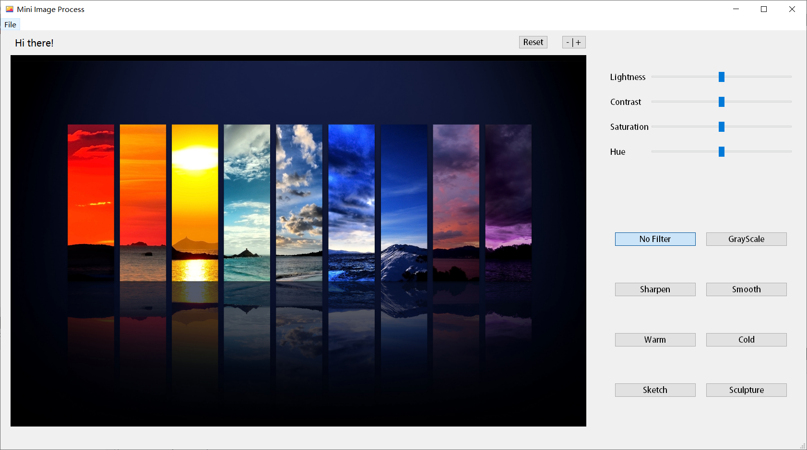
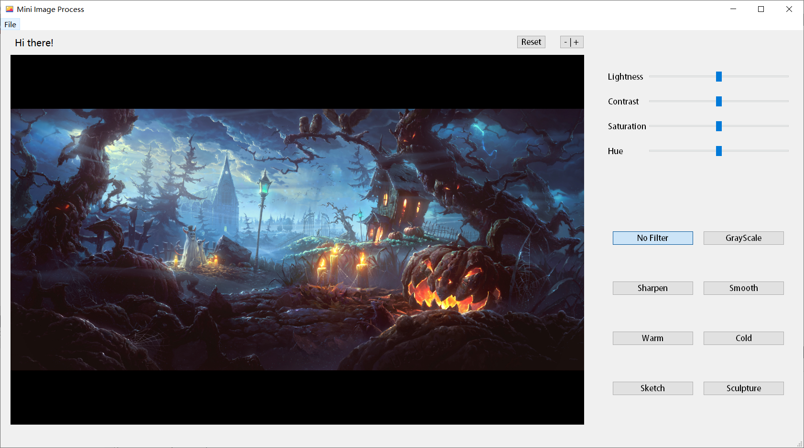
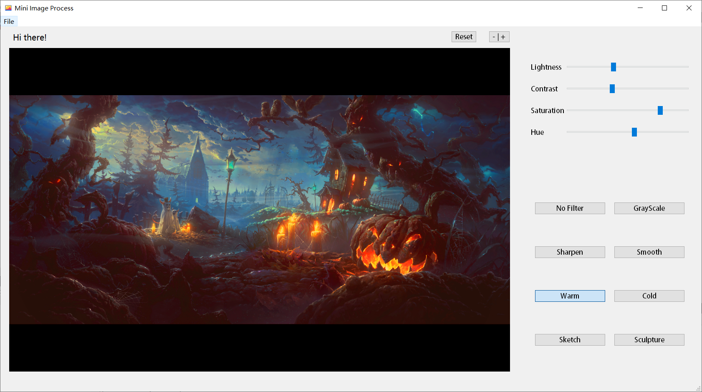
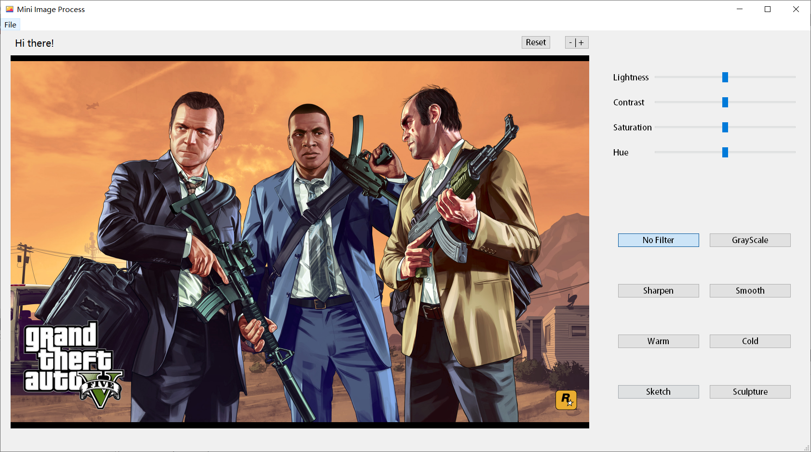
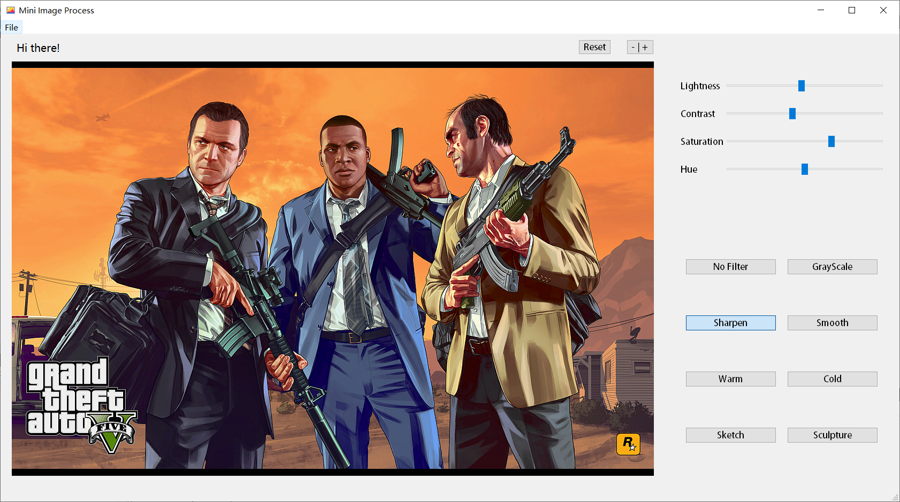
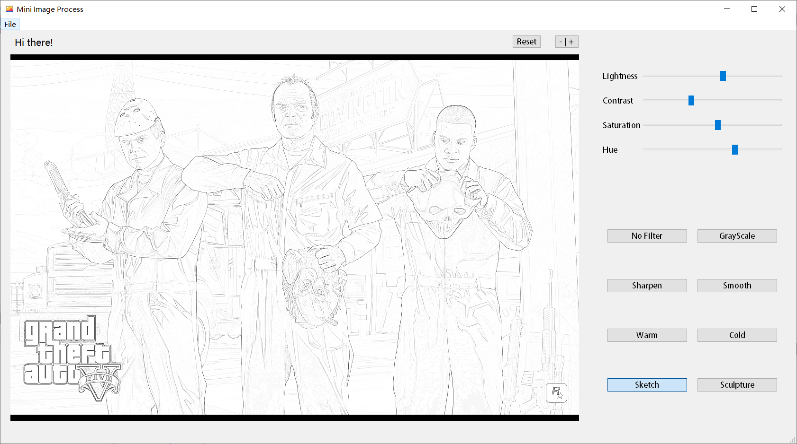

# mini-img-process

Mini image processing widget application built with Qt.

Just for fun, not completed.

## Functions

* Load files, (todo: save file);

* Adjust lightness, contrast, saturation, hue;

* Apply 7 kinds of filters;

## Screenshots

